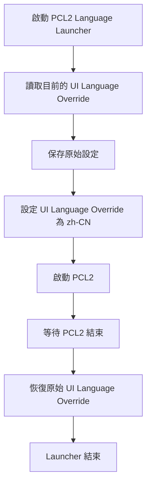

# PCL2 Language Launcher

<p align="center">
  <strong>讓 PCL2 在非簡體中文 Windows 環境下正常啟動</strong>
</p >

<p align="center">
  一個針對 Windows UI Language Override 的開源第三方輔助工具
</p >

[](https://github.com/zodfevtyn/PCL2LanguageLauncher/releases)
[](https://github.com/zodfevtyn/PCL2LanguageLauncher)
[](https://github.com/zodfevtyn/PCL2LanguageLauncher/blob/main/LICENSE)
## 專案簡介

**PCL2 Language Launcher** 是一個獨立的 Windows 開源輔助工具。

本專案主要面向這類使用者：

> Windows 顯示語言並非簡體中文 `zh-CN`，但希望正常使用 PCL2。

本工具會在啟動 PCL2 **之前**，暫時將目前使用者的 **Windows UI Language Override** 設定為 `zh-CN`。

當 PCL2 關閉後，程式會自動將設定恢復成啟動前的狀態。

**本工具不修改 PCL2 本體，也不需要修改 PCL2 原始程式。**

---

## 工作原理

PCL2 Language Launcher 不會修改 PCL2 的程式碼，也不會對 PCL2 進行 DLL 注入、API Hook 或其他程式碼修改。

整體流程如下：



核心使用的是 Windows 提供的 UI Language Override 設定機制。

主要操作包括：

- `Get-WinUILanguageOverride`
- `Set-WinUILanguageOverride`

因此，本工具本質上是一個：

**啟動前設定環境 → 啟動 PCL2 → PCL2 結束後恢復環境**

的輔助程式。

---

## 主要功能

### 自動尋找 PCL2

程式會依照預設搜尋順序尋找 PCL2：

1. 已保存的 PCL2 路徑
2. Launcher 所在目錄
3. Launcher 的 `PCL2` 子目錄
4. Launcher 的上層目錄
5. 上層目錄中的 `PCL2` 子目錄
6. 常見安裝目錄
7. 如果仍然找不到，提供手動選擇

需要尋找的執行檔名稱為：

```text
Plain Craft Launcher 2.exe
```

---

### 自動保存路徑

第一次手動選擇 PCL2 後，程式會保存 PCL2 的位置。

設定檔位於：

```text
%LOCALAPPDATA%\PCL2LanguageLauncher\pcl2-path.txt
```

因此不需要將使用者自己的 PCL2 路徑寫死在程式碼中。

---

### 自動恢復 Windows 語言設定

Launcher 啟動 PCL2 前會保存目前的 UI Language Override。

例如：

```text
原本：en-GB
  ↓
暫時：zh-CN
  ↓
啟動 PCL2
  ↓
PCL2 關閉
  ↓
恢復：en-GB
```

如果原本沒有設定 UI Language Override，程式也會按照原本狀態進行恢復。

---

### 不修改 PCL2

本工具不修改：

- PCL2 執行檔
- PCL2 程式碼
- PCL2 設定檔
- Minecraft 遊戲檔案

Launcher 只負責在 PCL2 啟動前後處理 Windows UI Language Override。

---

> [!WARNING]
> **請注意，本工具會暫時修改 Windows 使用者的 UI Language Override。**
>
> 雖然設定會在 PCL2 關閉後自動恢復，但如果在 Launcher 執行期間強制終止 Launcher、系統發生異常或其他非正常情況，可能導致 Override 暫時保持為 `zh-CN`。
>
> 如果發生這種情況，可以重新執行 Launcher，或者自行前往 Windows 語言設定進行調整。

---

## 適用使用者

本專案主要面向：

- 使用 Windows 10 / Windows 11 的使用者
- Windows 顯示語言不是 `zh-CN`
- 已經安裝 PCL2 的使用者
- 遇到 PCL2 與 Windows UI Language 相關問題的使用者
- 希望維持英文或其他 Windows 顯示語言，同時使用 PCL2 的使用者

本工具**不是 PCL2 的替代品**。

---

# 下載

請前往 GitHub **Releases** 下載最新版本：

**[PCL2 Language Launcher Releases](https://github.com/zodfevtyn/PCL2LanguageLauncher/releases)**

一般使用者只需要下載 Release 中的：

```text
PCL2LanguageLauncher.exe
```

不需要下載原始碼或自行編譯。

> [!TIP]
> 如果你只是想正常使用本工具，直接下載最新 Release 中的 `.exe` 即可。

---

## 系統需求

| 項目 | 要求 |
| --- | --- |
| 作業系統 | Windows 10 / Windows 11 |
| Framework | .NET Framework 4.8 |
| CPU 架構 | x64 |
| PCL2 | 需要自行安裝 |
| Minecraft | 不包含 |

---

# 使用方式

## 1. 安裝 PCL2

首先請自行取得並安裝 PCL2。

本工具**不包含 PCL2**。

---

## 2. 啟動 Launcher

執行：

```text
PCL2LanguageLauncher.exe
```

程式會自動尋找 PCL2。

如果找不到，會開啟檔案選擇視窗。

請選擇：

```text
Plain Craft Launcher 2.exe
```

---

## 3. 正常使用 PCL2

Launcher 會自動：

1. 保存原本的 UI Language Override
2. 暫時設定為 `zh-CN`
3. 啟動 PCL2
4. 等待 PCL2 關閉
5. 恢復原本的 UI Language Override

使用者不需要手動修改 Windows 顯示語言。

---

## 使用流程

```text
啟動 Launcher
     │
     ▼
尋找 PCL2
     │
     ▼
讀取目前 UI Language Override
     │
     ▼
保存原始設定
     │
     ▼
設定為 zh-CN
     │
     ▼
啟動 PCL2
     │
     ▼
等待 PCL2 關閉
     │
     ▼
恢復原始設定
     │
     ▼
Launcher 結束
```

---

# Minecraft 正版聲明

> [!IMPORTANT]
> **本專案支持 Minecraft 正版購買與合法使用。**
>
> 如果你有能力購買 Minecraft 正版，**我們強烈建議購買正版**，並透過官方方式使用 Minecraft。

本專案：

- 不提供 Minecraft
- 不提供 Minecraft 帳戶
- 不提供 Minecraft 授權
- 不提供 Minecraft 破解
- 不提供 Minecraft 啟動繞過
- 不提供任何 Minecraft 正版驗證繞過功能

本工具只處理：

**Windows UI Language 與 PCL2 啟動環境。**

如果你尚未購買 Minecraft，請優先考慮透過官方管道購買正版。

## Minecraft 官方購買

**[Minecraft Java & Bedrock Edition for PC](https://www.minecraft.net/zh-hans/store/minecraft-java-bedrock-edition-pc)**

## Minecraft 官方下載

**[Minecraft 官方下載頁面](https://www.minecraft.net/download/)**

---

# 關於 PCL2

**PCL2（Plain Craft Launcher 2）** 是一款 Minecraft 啟動器。

PCL2 並不是本專案的一部分。

本專案僅提供一個獨立的第三方啟動輔助工具，用於處理特定 Windows UI Language 環境下的啟動問題。

## PCL 相關開源專案

PCL Community：

**[PCL-Community/PCL2-4941](https://github.com/PCL-Community/PCL2-4941)**

相關授權與合理使用規範：

**[PCL2-Language LICENCE](https://github.com/PCL-Community/PCL2-Language/blob/main/LICENCE)**

請在使用、修改或分發與 PCL 相關的內容時，遵守其相應授權與合理使用規範。

---

# 與 PCL2 的關係

> [!NOTE]
> **PCL2 Language Launcher 並非 PCL 官方專案。**

本專案：

- 不屬於 PCL 官方開發團隊
- 不代表 PCL 官方
- 不由 PCL 官方維護
- 不修改 PCL2 本體
- 不重新發布 PCL2 本體
- 不包含 PCL2 執行檔

PCL2 的名稱、商標、程式碼及相關智慧財產權均屬於其各自權利人。

本專案僅在必要範圍內使用相關名稱，以說明本工具的用途與相容性。

---

# 隱私與安全

PCL2 Language Launcher 不需要使用者提供：

- Microsoft 帳戶資訊
- Minecraft 帳戶資訊
- Minecraft 密碼
- PCL2 帳戶資訊
- Minecraft 登入 Token

程式主要執行以下操作：

```text
讀取 Windows UI Language Override
            ↓
保存目前設定
            ↓
暫時設定 zh-CN
            ↓
啟動 PCL2
            ↓
等待 PCL2 結束
            ↓
恢復原本設定
```

PCL2 Language Launcher **不會修改 PCL2 執行檔本身**。

---

# 開源

本專案完全公開原始碼。

GitHub：

**[zodfevtyn/PCL2LanguageLauncher](https://github.com/zodfevtyn/PCL2LanguageLauncher)**

歡迎：

- 查看原始碼
- 學習實作方式
- 提交 Issue
- 提交 Pull Request
- 修改程式
- Fork 本專案

如果你發現更好的實作方式，也歡迎提出改進。

---

# 本機編譯

本專案使用：

- **C#**
- **.NET Framework 4.8**
- **Visual Studio**
- **x64**

開啟：

```text
PCL2LanguageLauncher.slnx
```

選擇：

```text
Release
x64
```

然後進行 Build。

---

# 專案結構

```text
PCL2LanguageLauncher/
│
├── PCL2LanguageLauncher/
│   ├── Program.cs
│   ├── PCL2LanguageLauncher.csproj
│   ├── App.config
│   └── Properties/
│       └── AssemblyInfo.cs
│
├── PCL2LanguageLauncher.slnx
├── README.md
├── LICENSE
└── .gitignore
```

---

# 問題回報

如果你遇到問題，歡迎前往 GitHub Issues：

**[提交 Issue](https://github.com/zodfevtyn/PCL2LanguageLauncher/issues)**

回報問題時，建議提供：

- Windows 版本
- PCL2 版本
- PCL2 Language Launcher 版本
- 錯誤訊息
- 問題發生時的操作步驟

請不要在 Issue 中提交：

- Microsoft 帳戶資訊
- Minecraft 帳戶資訊
- 密碼
- Token
- 其他私人資料

---

# 法律與撤回

本專案是一個獨立的第三方開源工具。

如果任何人認為本專案存在：

- 著作權問題
- 授權問題
- 商標問題
- 法律問題
- 與 PCL 相關的使用規範問題

或者 **PCL2 / PCL 相關開發者希望本專案進行修改、下架或撤回**，請聯絡：

**zodfevtyn21@gmail.com**

我會認真處理相關請求。

---

# License

本專案採用 **MIT License**。

Copyright (c) 2026 **Zod Fevtyn**

完整授權條款請參閱：

**[LICENSE](https://github.com/zodfevtyn/PCL2LanguageLauncher/blob/main/LICENSE)**

MIT License 僅適用於本專案由作者提供的程式碼與相關內容。

PCL2、Minecraft 以及其他第三方專案、商標與智慧財產權不受本專案 License 授權。

---

# 第三方資源

| 名稱 | 官方資源 |
| --- | --- |
| Minecraft | [minecraft.net](https://www.minecraft.net/) |
| Minecraft 官方購買 | [Minecraft Java & Bedrock Edition](https://www.minecraft.net/zh-hans/store/minecraft-java-bedrock-edition-pc) |
| Minecraft 官方下載 | [Download Minecraft](https://www.minecraft.net/download/) |
| PCL Community | [GitHub](https://github.com/PCL-Community) |
| PCL2 | [PCL2-4941](https://github.com/PCL-Community/PCL2-4941) |
| PCL 相關授權 | [PCL2-Language LICENCE](https://github.com/PCL-Community/PCL2-Language/blob/main/LICENCE) |

---

# Disclaimer

**PCL2 Language Launcher 按「現狀」提供，不提供任何明示或默示的保證。**

本專案作者不對因使用本工具而產生的任何直接或間接損失承擔責任。

使用本工具即代表你理解：

- 本工具會暫時修改 Windows UI Language Override
- PCL2 為第三方軟體
- Minecraft 為第三方產品
- 本專案不代表 PCL 或 Minecraft 官方

---

<p align="center">
  <strong>PCL2 Language Launcher</strong>
  <br>
  An open-source third-party Windows launcher utility for PCL2.
</p >

<p align="center">
  Made by <a href="https://github.com/zodfevtyn">zodfevtyn</a >
</p >
